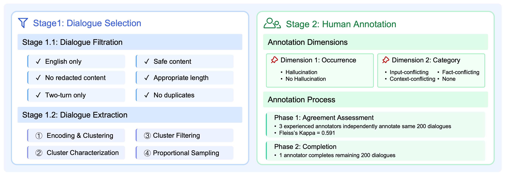

# Detecting Hallucinations in Authentic LLM-Human Interactions

**AuthenHallu** is a hallucination detection benchmark entirely grounded
in authentic LLM–human interactions. This repository provides the full dataset and the accompanying experimental code.

[📝 Full Paper](https://arxiv.org/abs/2510.10539) | [🤗 Dataset]()


## Benchmark Overview
### Basic Statistics
| Key   | Value |
|-------|:-------:|
|# Dialogues | 400 |
|# Hallucinated dialogues | 163 |
|# Query–response pairs per dialogue | 2 |
|# Total query–response pairs | 800 |
|# Hallucinated query–response pairs | 251 |
|# Tokens per query (avg.) | 20 |
|# Tokens per response (avg.) | 134 |

### Data Format
Each entry corresponds to a dialogue with two query-response pairs and provides pair-level hallucination annotations, including both binary occurrence labels and fine-grained category labels.  Our dataset is constructed based on [LMSYS-Chat-1M](https://huggingface.co/datasets/lmsys/lmsys-chat-1m). To comply with the [LMSYS-Chat-1M Dataset License Agreement](https://huggingface.co/datasets/lmsys/lmsys-chat-1m), we do not redistribute the original dialogue content. Instead, users can retrieve the corresponding dialogues from the source dataset using the provided `conversation_id`.
| Field | Type | Description |
|-------|------|-------------|
| `conversation_id` | string | A unique identifier for each dialogue, corresponding to the `conversation_id` in the [LMSYS-Chat-1M](https://huggingface.co/datasets/lmsys/lmsys-chat-1m) dataset. |
| `occurrence1` | string | Binary hallucination occurrence label for the first query-response pair, selected from {`Hallucination`, `No Hallucination`}. |
| `category1` | string | Hallucination type for the first query-response pair, selected from {`Input-conflicting`, `Context-conflicting`, `Fact-conflicting`, `None`}. |
| `occurrence2` | string | Binary hallucination occurrence label for the second query-response pair, selected from {`Hallucination`, `No Hallucination`}. |
| `category2` | string | Hallucination type for the second query-response pair, selected from {`Input-conflicting`, `Context-conflicting`, `Fact-conflicting`, `None`}. |

## Summary of Findings


## Citation
```bibtex
@article{ren2025detecting,
  title={Detecting Hallucinations in Authentic LLM-Human Interactions},
  author={Ren, Yujie and Gruhlke, Niklas and Lauscher, Anne},
  journal={arXiv preprint arXiv:2510.10539},
  year={2025}
}
```